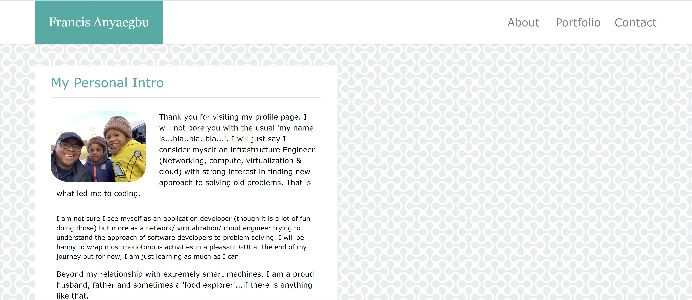
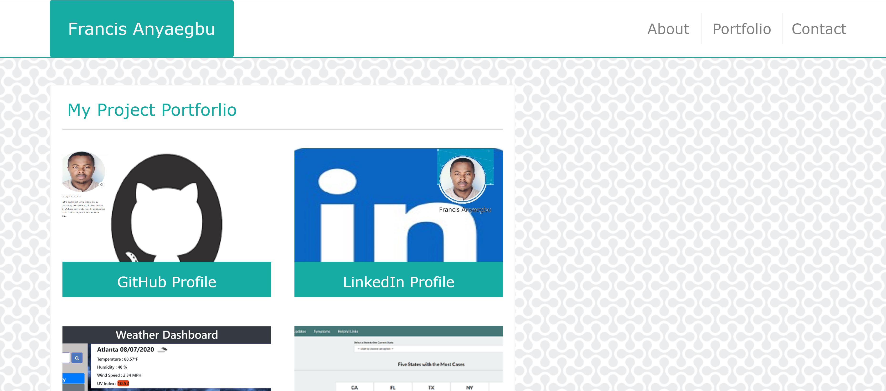
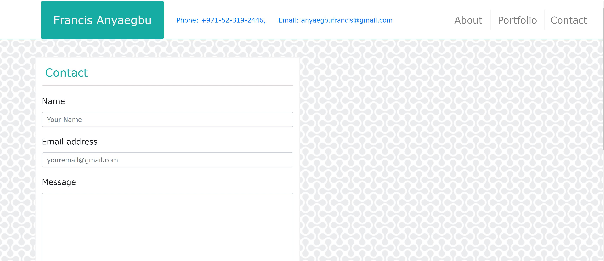

## ACTIVITY DESCRIPTION

This is a task that requires the use of a wireframe to design a responsive website. The site will be basic with responsive links and practically functional. CSS, Bootstrap and HTML are to be employed to achieve this.

The key requirement of this website is that it has to be responsive on multiple screen sizes and this form the basics of the customer requirement.

## My Approach:

# Design Stage

I used the following approach:

There was no need to design a wireframe as one was already shared.

Using basing columnar decisions, how many rows and columns are decided for each page. This depends on my understanding of the images and text that goes into each area.

I relied heavily on the use of internet to determine how to achieve each requirement.

#  HTML CODING STAGE
I started out by coding the basic tasteless HTML page. Again, I employed the use of classes, IDs and tags to enble me manipulate each or group of areas easily. Determining how to arrange the body wasn't much of a challenge but I did a few study and internet search or two to see if I could find better ways of doing some tasks.

# STYLING STAGE

This was the challenging part. I had to style each area in such a way that it meets the requirements. I tried at first to have some reusable blocks of HTML groups in multiple pages but it was getting difficult for me, so I decided to have different styling for each page. 

I was able to embed an icon to the title. I grouped all the pages into the folder - Pages. The Images I used in this project were put in 'Images' Folder whole the index.html page is what appears on the main project page.

# TESTING AND VALIDATION

The result was tested using mostly google inspect. I tried it on multiple screen sizes while introducing further styling to achieve the end result.

# Project Landing Page

# Project Portforlio Page

# Project Contact Page

# Link To Project Deployment:

Please click [here](https://anyaegbufrancis.github.io/responsive.portforlio/) to view the github hosted project.

# Link To Project Repo:

Please click [here](https://github.com/anyaegbufrancis/responsive.portforlio) to view the github repository for this project.

# OTHER EFFORTS

I tried to improve on my code arrangement. I also tried to use HTML semantic tags wherever I could.

I tried to make sure that the website links are functional.

I did not do much pseudo codes like hover and focus on the navbar and other sections. However, the site is a basic study of responsiveness and I tried to achieve that as much as possible.

For comments or notes, please drop me a message on anyaegbufrancis@gmail.com and I will appreciate your feedback.